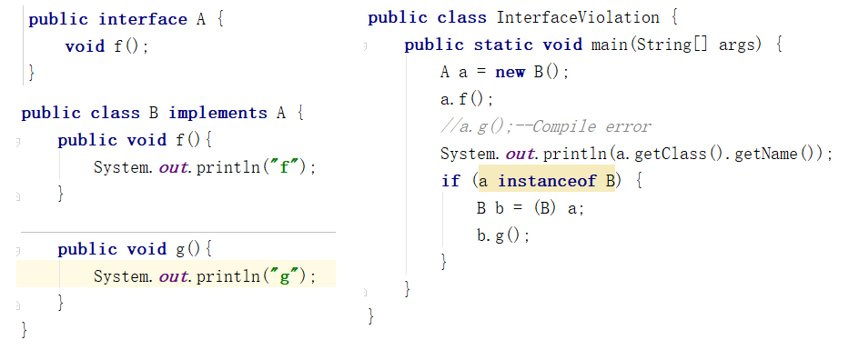
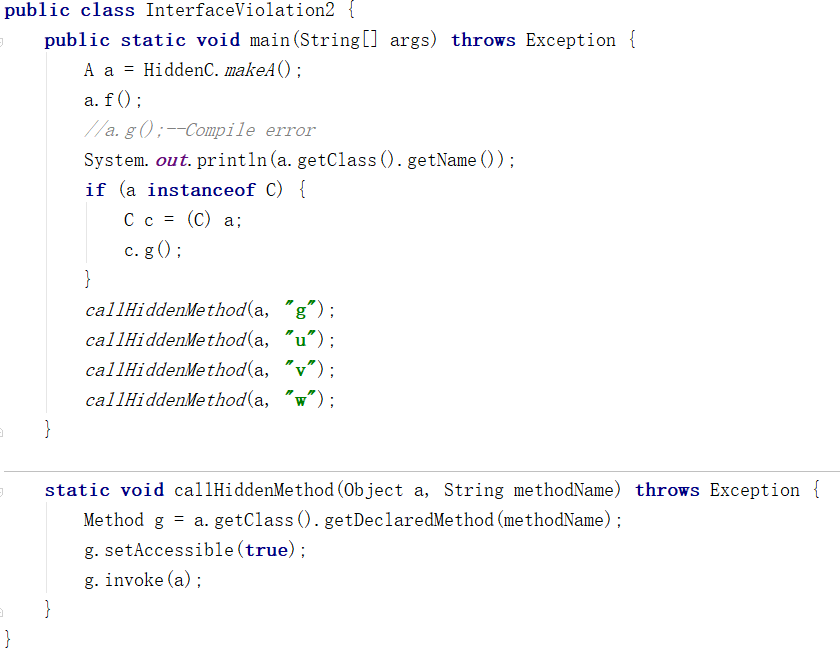

## 类型信息
#### 如何在运行时识别对象和类的信息
###### RTTI
* 概述
> 在Java中所有的类型转换都是在运行时进行正确检查的；
> 在编译时，由容器和Java的泛型强制保证类型的正确性，在运行时，由类型转换来保证类型的正确性；
> Java程序在它开始运行之前并非被完全加载的，其各个部分是在必需时才加载的；
> 类型转换：向上转型（安全），向下转型（不安全），运行时类型识别RTTI；
* 传统的类型转换
* Class对象，Class.forName(XX)是获取Class对象的引用的一种方法，会自动初始化该Class对象；
> Class cc=Class.forName(XX)；
> cc.getName()，需要置于try-catch中；
> cc.isInterface()； 
> cc.getSimpleName()； 
> cc.getCanonicalName()；
> cc.getInterfaces()；
> cc.getSuperclas()，在编译期就知道了；
> cc.newInstance()，必须要求cc这个Class对象有默认的构造器；
* 类字面常量
> Class.class，简单而且安全；
> 不仅可以运用于普通的类，也可以运用于接口、数组以及基本数据类型；
> 对于基本类型的包装器，有一个标准字段TYPE（其实是一个引用），指向对应的包装器类型的Class对象；
> 不会自动初始化该Class对象，初始化被延长到了对静态方法（构造器隐式地是静态的）或者非常数静态域进行首次引用时才执行；
* 泛化的Class引用
> Class<Integer> intClass = int.class；
> Class<?> intClass = int.class；
> Class<? extends Number> intClass = int.class；
* 类型检查 instanceof
> x instanceof class等价于class.isInstance(x)；
###### 反射
* 反射
> 对RTTI来说，编译期就能打开和检查.class文件；但对反射来说，编译期并不能获取到.class文件，需要到运行时才能打开和检查.class文件；
> Class类+java.lang.reflect类库一起为反射提供了支持；
> Constructor类、Field、Method、getFields()、getMethods()、getConstuctors()；
* 代理、动态代理
> Proxy.newProxyInstance()
> 通过反射，可以调用所有方法甚至是private方法

###### 接口与类型
